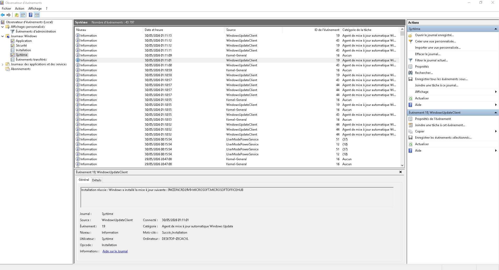
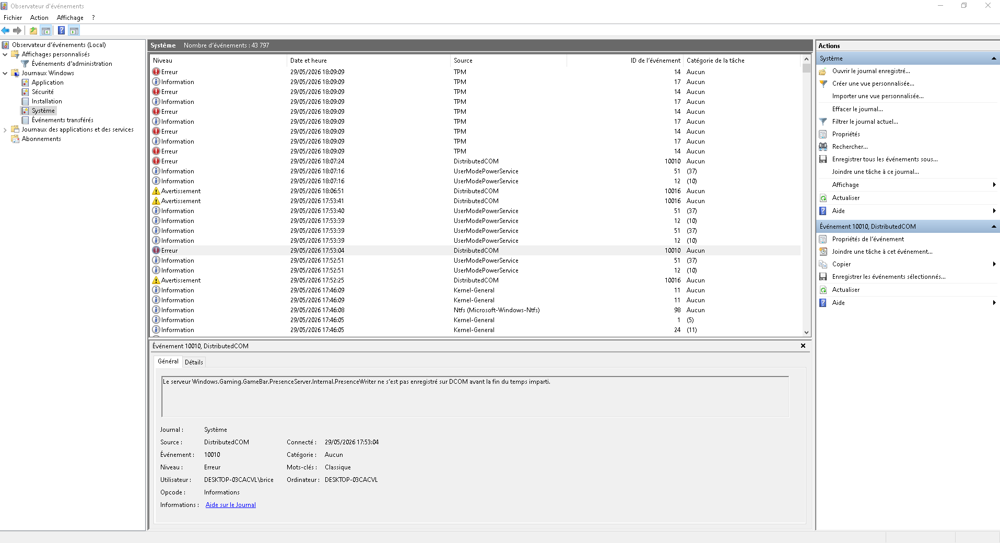
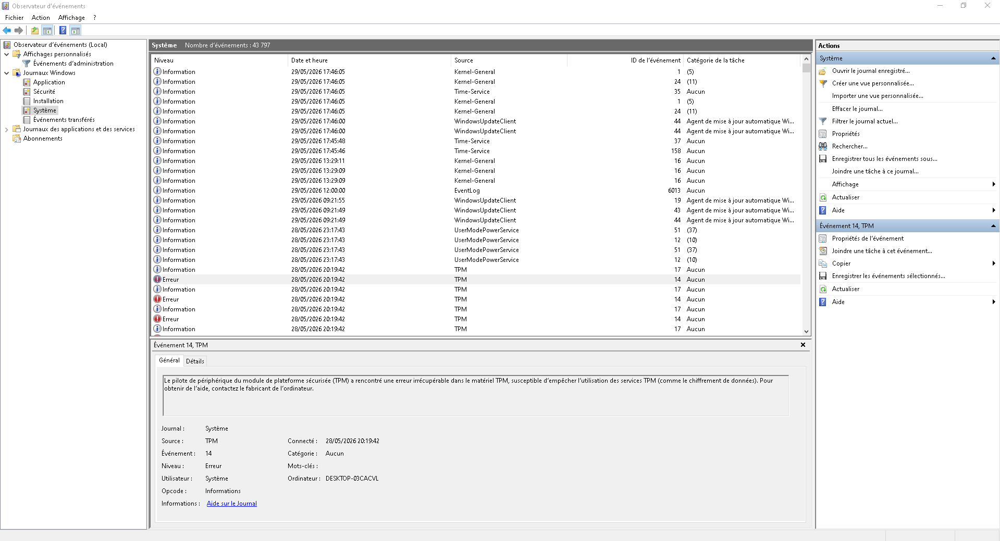
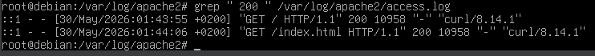
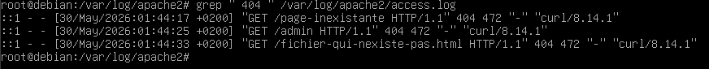
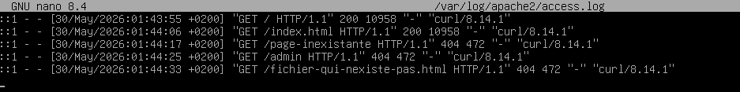

# Les Logs

# EXERCICE 1 

- Imagine que tu es responsable des logs réseau. Énumère un scénario spécifique dans lequel les logs seraient cruciaux et explique pourquoi.

  - **Scénario** : Un employé clique sur un lien étrange et se fait avoir par une attaque "phishing"
  - **Importances des logs** : grâce aux logs on peut voir des scans de ports massif depuis le poste de l'employé vers d'autre machine du réseau interne, et donc controlé et sécurisé l'attaque
 
# EXERCICE 2 

Analyse l'entrée de log suivante et réponds aux questions :

2023-07-28 09:15:23 [WARNING] [FileSystem] Disk usage on /dev/sda1 has reached 85%
- Quel est le timestamp de cet événement ? : 2023-07-28 09:15:24 
- Quel est le niveau de log ? [WARNING]
- Quelle est la source du log ? [FileSystem]
- Quel est le message principal ? Disk usage on /dev/sda1 has reached 85%
- Quelle action recommanderais-tu suite à ce log ? Faire un tri dans le disque, vider la corbeille , rajouter un disque dur

# EXERCICE 3 

Choisis l'un des outils mentionnés (par exemple, journalctl si tu es sur Linux, ou l'Observateur d'événements si tu es sur Windows). Utilise-le pour consulter les logs système des dernières 24 heures. Note trois événements intéressants que tu as trouvés et explique pourquoi ils ont attiré ton attention.

- **1er événements** : J'ai pris ce log là car grâce a lui on peut voir en détails quelle MAJ à été faites

-**2eme événements** : Message d'erreur montrant que le serveur Windows.Gaming.Bar ne s'est pas enregistré sur DCOM avant la fin impartit (normal je l'ai désactivé de base)

-**3eme événements** : Erreur qui me parait plutot grave mais comme je sais pas trop ce que ca veut dire c'est dans les mains de Dieu maintenant

# CHALLENGE

- **Les requêtes réussies (code 200)**

- **Les erreurs 404 (page non trouvée)**

- **Les adresses IP les plus fréquentes**
J'ai fais les requetes curl depuis le serveur Debian directement, donc les seuls adresses sont celle du localhost

